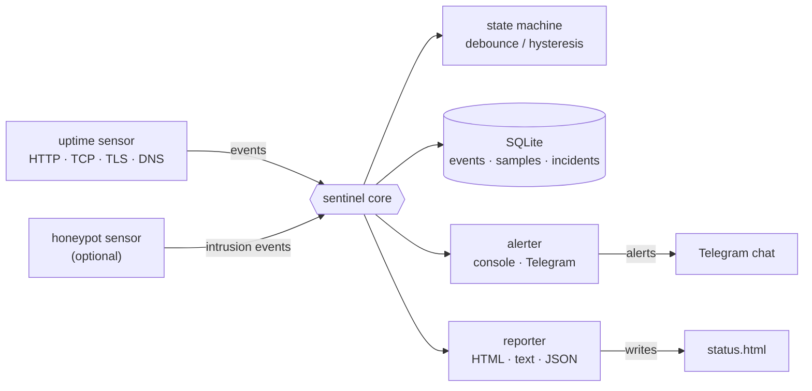
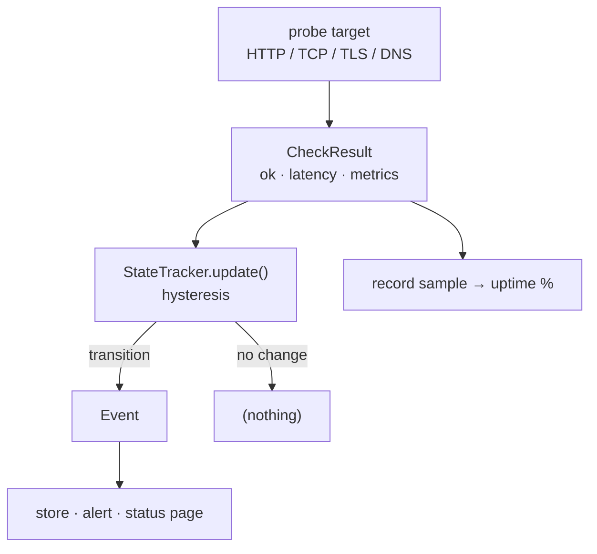
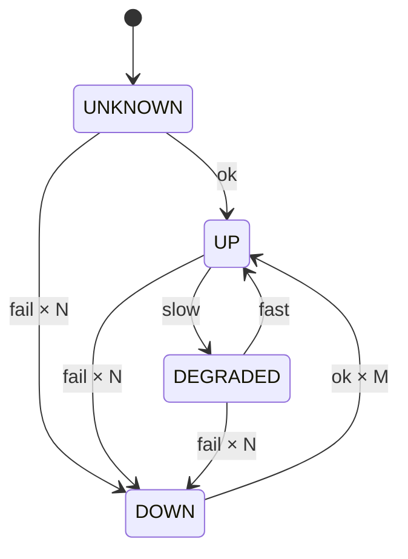

English | [Русский](README.ru.md)

# sentinel

**sentinel** is a small, self-hosted uptime / TLS monitor with Telegram alerts. It probes your HTTP endpoints, TCP ports, TLS certificates and DNS records on a schedule, debounces flapping with a state machine, records history to SQLite, alerts to the console and Telegram, and renders a static dark-theme HTML status page. It is written against the Python **standard library only** — no third-party runtime dependencies, runs on any Python 3.10+ with nothing to install. The design is plugin/event-driven: *sensors* observe the world and emit `Event`s into a shared core (store + alerter + reporter), so the shipped `uptime` sensor can sit beside future sensors (an SSH honeypot is the next planned one) without touching the core.

## Features

- **Four check types** in one tool: `http` (status code, expected text, latency), `tcp` (port reachable + latency), `tls` (certificate validity + days-until-expiry warning), `dns` (resolves + optional expected IP).
- **Debounce / hysteresis** — N consecutive failures before DOWN, M consecutive successes before recovery, so a single flap never pages you.
- **Latency-aware** — a target that responds but is slower than `degraded_ms` is marked DEGRADED rather than UP.
- **Telegram alerts** out of the box, on top of console output. Alerts fire only on state *transitions* (continuous mode), so you get one message per incident, not one per poll.
- **SQLite history** — events, samples (for uptime %), and open/closed incidents.
- **Optional intrusion honeypot** — a low-interaction TCP listener (e.g. on the SSH port) that grants **no** access but logs who connects and their client banner, emitting `intrusion` events into the same store / alerts / status page. sentinel's second sensor — still standard-library only, and a burst of new sources is aggregated into one alert instead of spamming you.
- **Static HTML status page** — a self-contained, dark-theme, no-JavaScript page you can drop on any static host.
- **cron / CI friendly** — a one-shot `check` command exits `0` / `1` / `2` for up / degraded / down.
- **Secrets stay out of the repo** — the Telegram bot token is referenced by *environment-variable name* in the config, never written into the file.
- **Standard library only** — no `pip install` of runtime deps, ever.

## Architecture



The core is deliberately thin. A **sensor** is anything that emits `Event`s; the `Engine` collects events each tick, persists them to the **store**, hands non-INFO events to the **alerter**, and asks the **reporter** to re-render the status page. Because the seam is just "emit an `Event`", adding a new capability means writing a new sensor — the store, alerter and reporter are reused unchanged. The shipped `UptimeSensor` is poll-based; a listener-based sensor (e.g. an SSH honeypot emitting `intrusion` events) plugs into the very same core.

Within the `uptime` sensor, every tick runs the same probe → state → event flow for each target:



A probe always returns a `CheckResult` (it never raises), which the `StateTracker` folds into the per-target health using hysteresis. Only when the status actually *changes* does an `Event` come out — otherwise nothing is alerted. Every probe also writes a sample row, which is what the uptime percentage is computed from.

The per-target health follows this state machine (`fail × N` = `fail_threshold` consecutive failures, `ok × M` = `recover_threshold` consecutive successes):



The UP ↔ DEGRADED transition is a *soft*, immediate latency call; the transitions into and out of DOWN require the debounce thresholds to be met.

## Quick start

```bash
git clone https://github.com/githubuseradmin/sentinel.git
cd sentinel

# Copy the example config and edit the targets for your services
cp sentinel.config.example.json sentinel.config.json

# (Optional) wire up Telegram — see "Telegram alerts" below
# then run a one-shot check (good for confirming the config works):
python -m sentinel check -c sentinel.config.json

# Run the continuous monitor (Ctrl+C to stop):
python -m sentinel run -c sentinel.config.json
```

Setting the Telegram environment variables (whose *names* you put in the config):

```bash
# bash / sh
export SENTINEL_BOT_TOKEN="123456:ABC-your-bot-token"
export SENTINEL_CHAT_ID="987654321"
```

```powershell
# PowerShell
$env:SENTINEL_BOT_TOKEN = "123456:ABC-your-bot-token"
$env:SENTINEL_CHAT_ID   = "987654321"
```

`-c` defaults to `sentinel.config.json`, so once that file exists you can omit it: `python -m sentinel run`.

## Configuration

The config is a single JSON file. Global settings sit at the top; `targets` is a non-empty array of things to watch. Relative `db_path` / `status_page` paths are resolved against the config file's directory.

### Global fields

| Field | Type | Default | Description |
|---|---|---|---|
| `interval_seconds` | int | `60` | Seconds between polls in `run` mode. Floored to a minimum of `5`. |
| `db_path` | string | `"sentinel.db"` | SQLite database file for events, samples and incidents. |
| `status_page` | string | *(none)* | If set, the HTML status page is (re)written here after every tick / check. |
| `retention_days` | int | `30` | In `run` mode, history (samples/events/closed incidents) older than this is pruned hourly. |
| `telegram.bot_token_env` | string | *(none)* | **Name** of the env var holding the Telegram bot token. |
| `telegram.chat_id_env` | string | *(none)* | **Name** of the env var holding the target chat id. |

`telegram` is optional; Telegram alerting turns on only when both the bot token and chat id resolve to non-empty values. (For convenience the loader also accepts inline `bot_token` / `chat_id` literals, but the env-var-name form is the intended, repo-safe one.)

### Honeypot (optional intrusion sensor)

| Field | Type | Default | Description |
|---|---|---|---|
| `honeypot.enabled` | bool | `false` | Turn the low-interaction TCP honeypot on. |
| `honeypot.port` | int | `2222` | Port to listen on (use ≥1024 unless running as root). |
| `honeypot.host` | string | `""` | Bind address (empty = all interfaces). |
| `honeypot.banner` | string | `""` | Optional banner sent on connect (e.g. `SSH-2.0-OpenSSH_8.9`) to draw out a client banner. |

The listener only binds in `run` / `serve` mode (never during `check` / `status`). It grants no access — it just records each connection (an INFO event) and, on the **first** sighting of a source IP within a re-alert window, fires a **WARNING** alert; a burst of many new sources is aggregated into one summary so a scan can't spam you. Point it at a public host to catch real traffic.

### Per-target fields

| Field | Type | Default | Applies to | Description |
|---|---|---|---|---|
| `name` | string | *(required)* | all | Unique, human-readable target name. |
| `type` | string | *(required)* | all | One of `http`, `tcp`, `tls`, `dns`. |
| `target` | string | *(required)* | all | URL (`http`), `host:port` (`tcp`/`tls`), or hostname (`dns`). |
| `timeout` | number | `10.0` | all | Per-probe timeout in seconds. |
| `expect_status` | int | *(none)* | `http` | Required HTTP status code; mismatch ⇒ failure. |
| `expect_text` | string | *(none)* | `http` | Substring that must appear in the response body. |
| `degraded_ms` | number | *(none)* | all | Latency above this (ms) marks the target DEGRADED instead of UP. |
| `cert_warn_days` | int | `14` | `tls` | Warn once when the certificate expires within this many days. |
| `expect_ip` | string | *(none)* | `dns` | Resolution must include this IP; otherwise failure. |
| `fail_threshold` | int | `2` | all | Consecutive failures required to declare DOWN. |
| `recover_threshold` | int | `2` | all | Consecutive successes required to clear an outage. |

### Example config

```json
{
  "interval_seconds": 60,
  "db_path": "sentinel.db",
  "status_page": "status.html",
  "retention_days": 30,

  "honeypot": { "enabled": false, "port": 2222, "banner": "SSH-2.0-OpenSSH_8.9" },

  "telegram": {
    "comment": "Secrets are referenced by ENV VAR NAME, never written here.",
    "bot_token_env": "SENTINEL_BOT_TOKEN",
    "chat_id_env": "SENTINEL_CHAT_ID"
  },

  "targets": [
    {
      "name": "website",
      "type": "http",
      "target": "https://example.com",
      "expect_status": 200,
      "expect_text": "Example Domain",
      "degraded_ms": 1500,
      "cert_warn_days": 21
    },
    {
      "name": "api",
      "type": "http",
      "target": "https://api.example.com/health",
      "expect_status": 200,
      "fail_threshold": 3
    },
    {
      "name": "postgres",
      "type": "tcp",
      "target": "db.example.com:5432",
      "timeout": 5
    },
    {
      "name": "tls-cert",
      "type": "tls",
      "target": "example.com:443",
      "cert_warn_days": 30
    },
    {
      "name": "dns",
      "type": "dns",
      "target": "example.com",
      "expect_ip": "93.184.216.34"
    }
  ]
}
```

## CLI

sentinel runs as a module: `python -m sentinel <command>`. All commands take `-c/--config` (default `sentinel.config.json`). `python -m sentinel --version` prints the version.

### `run` — continuous monitoring

```bash
python -m sentinel run -c sentinel.config.json
```

Polls every target every `interval_seconds`, debounces with the state machine, and alerts **only on state transitions**. The initial "is UP" notice is logged but suppressed from alert channels, so a healthy start is quiet. If `status_page` is configured it is rewritten after every tick. Runs until interrupted (Ctrl+C).

```
sentinel watching 5 target(s), every 60s. Ctrl+C to stop.
🔴 [critical] api is DOWN — HTTPError: HTTP Error 503: Service Unavailable
✅ [recovery] api recovered (UP) — HTTP 200
```

### `check` — one-shot health (cron / CI)

```bash
python -m sentinel check -c sentinel.config.json          # human-readable
python -m sentinel check -c sentinel.config.json --json    # machine-readable
```

Probes every target once, prints a snapshot, and exits with a code reflecting the *current* overall health. This mode is point-in-time — there is **no debounce** — so it reports exactly what is true right now, which is what you want from a cron job or a CI gate.

```
sentinel — DOWN  (2026-06-30 12:00:00 UTC)

  [up      ] website            142 ms  up   99.90%  HTTP 200
  [down    ] api                     —  up   98.10%  HTTPError: HTTP Error 503: Service Unavailable
  [up      ] postgres            12 ms  up  100.00%  connected db.example.com:5432
  [up      ] tls-cert            58 ms  up  100.00%  valid, 64d left
  [up      ] dns                  9 ms  up  100.00%  93.184.216.34
```

Exit codes:

| Code | Overall status | Meaning |
|---|---|---|
| `0` | up (or unknown) | All targets healthy. |
| `1` | degraded | At least one target is slow but reachable; none down. |
| `2` | down | At least one target is down. |

A config error exits `2` as well (with a `config error:` message on stderr).

### `status` — render the HTML status page

```bash
python -m sentinel status -c sentinel.config.json -o status.html
```

Probes every target once and writes the dark-theme HTML status page. The output path comes from `-o/--output`, falling back to `status_page` in the config; if neither is set the HTML is printed to stdout (handy for piping). Great for a cron-driven static status page.

### `serve` — monitor loop + live HTTP status page

```bash
python -m sentinel serve -c sentinel.config.json --port 8787
```

Runs the continuous monitor loop **and** serves the status page over HTTP in one process — no reverse proxy or static host required. `tick()` runs in a background daemon thread every `interval_seconds`; the foreground thread is a stdlib `http.server` that renders a **fresh** snapshot on each request, so the page is always current. Ctrl+C stops both cleanly.

Routes:

| Path | Response |
|---|---|
| `/` | The dark-theme HTML status page. |
| `/status.json` | The full snapshot as JSON. |
| `/health` | Same JSON snapshot (handy as a health endpoint / uptime probe). |
| *anything else* | `404 Not Found`. |

`--port` defaults to `8787`; `--host` defaults to all interfaces (bind to `127.0.0.1` to keep it local). Everything is standard-library only.

```
sentinel serving on http://0.0.0.0:8787 (/, /status.json, /health), watching 5 target(s) every 60s. Ctrl+C to stop.
```

## Status page

The status page is a single self-contained HTML file — inline CSS, no JavaScript, dark theme. It shows the overall status badge, a per-target table (status, address, latency, 24-hour uptime %, detail), open incidents, and the most recent events.

Three ways to keep it fresh:

- **Continuous** — set `status_page` in the config and run `python -m sentinel run`; the page is rewritten after every poll.
- **Cron** — schedule `python -m sentinel status -o /var/www/status.html` and serve that directory from any static host (Nginx, GitHub Pages, S3, …).
- **Live HTTP** — run `python -m sentinel serve`; the built-in stdlib server monitors *and* serves the page (plus a JSON endpoint) with no external host.

The generated `status.html` is gitignored, so it never gets committed by accident.

## Telegram alerts

Console alerts are always on. Telegram is added automatically when a bot token **and** a chat id are both configured. Messages are sent through the Telegram Bot HTTP API using stdlib `urllib` — no SDK. Delivery is best-effort: any failure (no token, network error, Telegram error) is swallowed, so a flaky alert channel can never crash the monitor.

Setup:

1. **Create a bot** — message [@BotFather](https://t.me/BotFather), send `/newbot`, and copy the token it gives you (e.g. `123456:ABC-...`).
2. **Find your chat id** — message your bot once, then open `https://api.telegram.org/bot<TOKEN>/getUpdates` and read `result[].message.chat.id`. (For a group, add the bot to the group and use the group's chat id, which is usually negative.)
3. **Export the env vars** and reference their *names* in the config (`bot_token_env` / `chat_id_env`):

   ```bash
   export SENTINEL_BOT_TOKEN="123456:ABC-your-bot-token"
   export SENTINEL_CHAT_ID="987654321"
   ```
   ```powershell
   $env:SENTINEL_BOT_TOKEN = "123456:ABC-your-bot-token"
   $env:SENTINEL_CHAT_ID   = "987654321"
   ```

> **Operational note (Belarus):** Telegram's API is frequently unreachable from networks inside Belarus, so alerts will silently fail to deliver if the host has no route to `api.telegram.org`. Run sentinel on a VPS outside Belarus or route the host's traffic through a VPN — the same constraint applies to the other Telegram bots in this portfolio.

## How it works

sentinel is event-driven. Each tick, the `Engine` asks every sensor to `poll()`; the shipped `UptimeSensor` runs each target's probe, feeds the `CheckResult` into that target's `StateTracker`, and emits an `Event` only when the status *transitions* (plus a one-shot certificate-expiry warning). Every probe also records a sample row, which is what the rolling 24-hour uptime percentage is computed from. The engine persists each event to SQLite, sends non-INFO events to the alerter (console + Telegram), and re-renders the status page.

The debounce lives in `StateTracker` (see the [state machine diagram](#architecture)): it counts consecutive failures and successes and only flips to DOWN after `fail_threshold` failures, only clears an outage after `recover_threshold` successes, and treats the UP ↔ DEGRADED latency boundary as an immediate soft transition. Because the tracker is pure (no I/O), the transition logic is fully unit-testable. When a target goes DOWN an incident is opened; when it recovers, that incident is closed — open incidents surface on the status page.

`run` mode debounces and alerts on transitions; `check` mode is the point-in-time path used by cron/CI and does no debouncing — it simply reports the live result and maps the overall status to an exit code.

## Project layout

```
sentinel/
├── sentinel/
│   ├── __init__.py          # package metadata (__version__) + overview docstring
│   ├── __main__.py          # enables `python -m sentinel`
│   ├── cli.py               # argparse CLI: run / check / status
│   ├── config.py            # JSON config loader → Settings + Target (secrets by env-var name)
│   ├── models.py            # shared types: Status, Severity, Target, CheckResult, Event
│   ├── checks.py            # the four probes (http / tcp / tls / dns), stdlib only
│   ├── state.py             # StateTracker — per-target hysteresis / debounce
│   ├── engine.py            # the core: drives sensors, persists, alerts, reports
│   ├── store.py             # SQLite store: events, samples (uptime %), incidents
│   ├── alerts.py            # Console + Telegram alerters (urllib), fail-safe fan-out
│   ├── report.py            # render snapshot as HTML / text / JSON
│   └── sensors/
│       ├── __init__.py      # Sensor base class + the sensor-plugin contract
│       └── uptime.py        # UptimeSensor: probe → state → Event, cert warnings
├── tests/                   # stdlib unittest suite
├── sentinel.config.example.json   # annotated example config
├── requirements.txt         # documents the "stdlib only" stance (no runtime deps)
├── .gitignore               # ignores real config, *.db, status.html, secrets
└── README.md
```

## Running the tests

The test suite uses the standard-library `unittest` runner — nothing to install:

```bash
python -m unittest discover -s tests
```

The pure pieces are designed to be tested without a network: `parse_host_port` and `cert_days_left` in `checks.py`, the whole `StateTracker` transition table in `state.py`, the config parser (`parse_config` is split out as a pure function), and the string-building reporters in `report.py`.

## Extending it

The sensor seam exists so the core can grow new capabilities without changing. A sensor is anything that subclasses `sentinel.sensors.Sensor` and emits `Event`s; the store, alerter and reporter handle them for free. Two sensors ship today, and they prove the seam works for both styles:

- **`uptime`** — *poll-based*: `poll()` runs the checks and returns new events each tick.
- **`honeypot`** — *listener-based*: a background socket server captures connections and buffers them; `poll()` drains that buffer into `intrusion` events. It lands in the same SQLite store, the same Telegram alerts, and the same status page.

Adding a third sensor means writing one `poll()` — the core is untouched. The `Event.kind` field spans them (`"state_change"`, `"cert_expiring"`, `"honeypot_hit"`, `"intrusion"`).

## License

Portfolio / demo project. Use freely.
