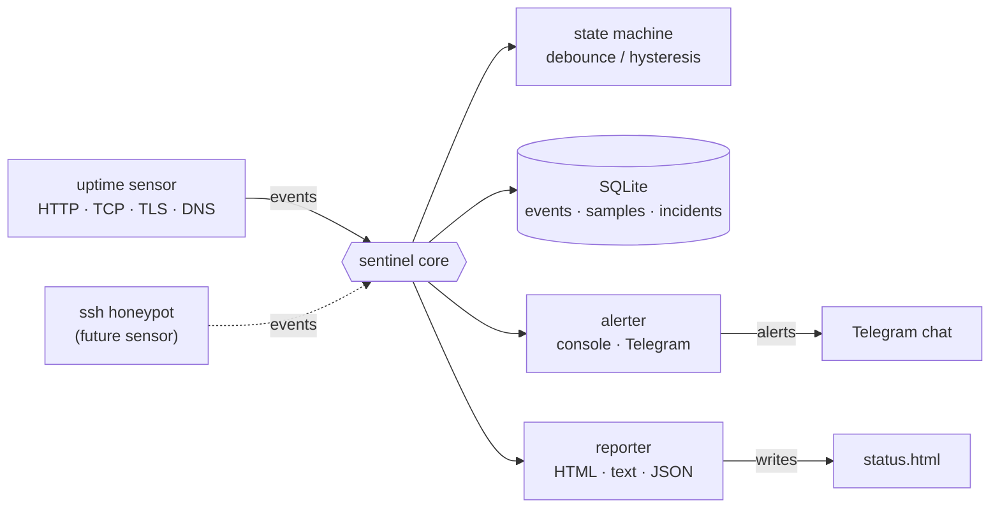
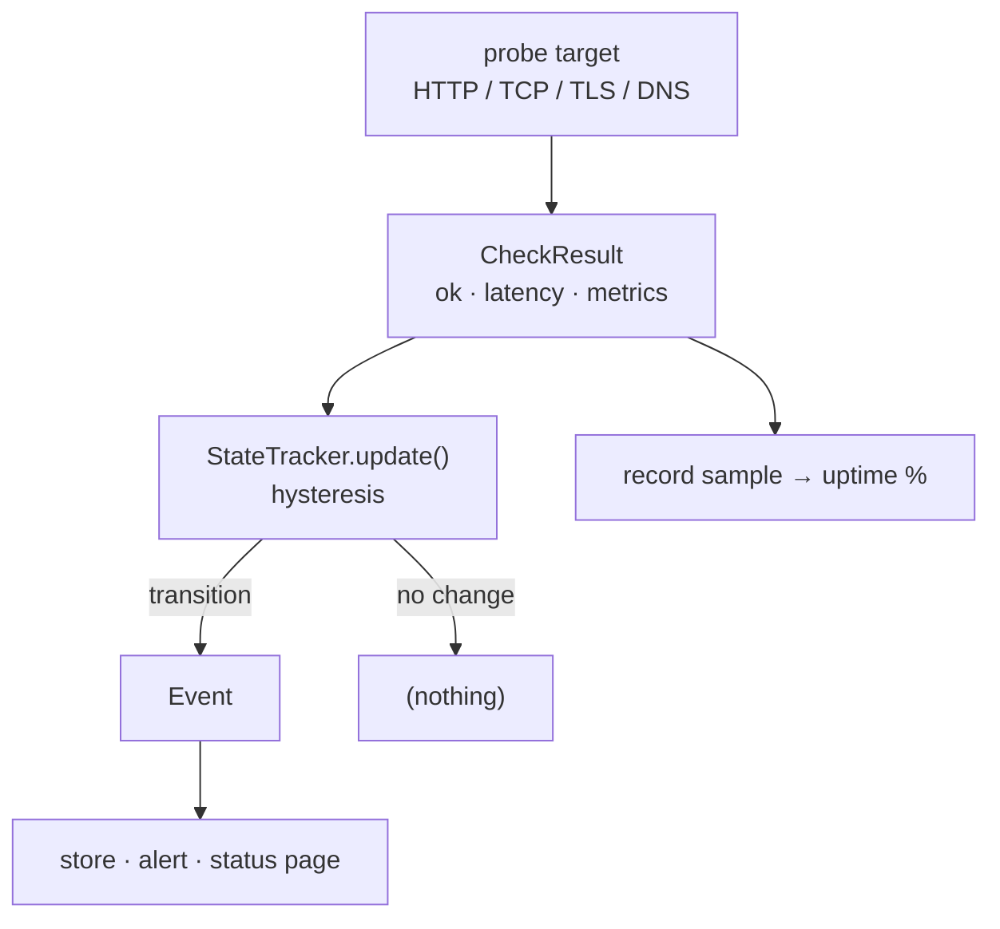
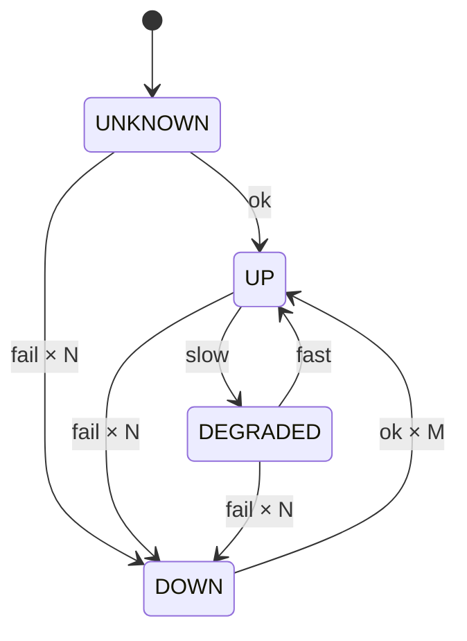

[English](README.md) | Русский

# sentinel

`sentinel` — небольшой **self-hosted монитор доступности и TLS с алертами в Telegram**. Он написан на **чистой стандартной библиотеке Python** (никаких сторонних runtime-зависимостей) и работает на любом Python 3.10+ без установки чего-либо. Архитектура **плагинная и событийная**: *сенсоры* наблюдают за миром и эмитят объекты `Event` в общее ядро (SQLite-хранилище + алертер + репортер). В комплекте идёт сенсор `uptime`, который проверяет доступность по HTTP / TCP / TLS / DNS, ведёт историю в SQLite, рендерит статичную **HTML-страницу статуса** (тёмная тема) и шлёт алерты в консоль и Telegram. Секреты (токен Telegram-бота) задаются **именем переменной окружения** в JSON-конфиге, поэтому ничего чувствительного не попадает в репозиторий.

Репозиторий: <https://github.com/githubuseradmin/sentinel>

## Возможности

- **Четыре типа проверок**, всё на stdlib:
  - `http` — код ответа (+ опциональный ожидаемый текст в теле) и латентность;
  - `tcp` — доступность `host:port` и латентность;
  - `tls` — валидность сертификата + предупреждение о приближающемся сроке;
  - `dns` — резолвится ли имя (+ опциональный ожидаемый IP).
- **Антидребезг (гистерезис)**: N подряд фейлов переводят таргет в DOWN, M подряд успехов — восстанавливают. Один случайный сбой никого не будит.
- **Порог латентности**: медленный, но живой ответ помечается как DEGRADED.
- **Алерты в Telegram** через Bot HTTP API (на `urllib`), плюс всегда включённый консольный канал. Сбой доставки не роняет монитор.
- **Долговечная история в SQLite**: события, сэмплы (для расчёта uptime %) и инциденты (открываются на DOWN, закрываются при восстановлении).
- **Статичная HTML-страница статуса** (тёмная тема, инлайновый CSS, без JS) — выкладывается на любой статический хостинг или открывается локально.
- **Режим `check` для cron/CI** с осмысленным exit-кодом (0 / 1 / 2).
- **Без секретов в репозитории**: токен бота берётся из переменной окружения по её имени.
- **Расширяемость**: сенсорный шов рассчитан на будущий сенсор **SSH-ханипот** (listener-based), который будет эмитить `intrusion`-события через то же ядро.

## Архитектура

`sentinel` — это событийное ядро, в которое *сенсоры* эмитят объекты `Event`. Ядро сохраняет их в SQLite, прогоняет через алертер и репортер. В комплекте один сенсор (`uptime`), но шов рассчитан на добавление новых (например, SSH-ханипота) без изменения ядра.



Путь одной проверки: таргет зондируется, результат (`CheckResult`) скармливается машине состояний с гистерезисом; `Event` рождается только при смене состояния. Параллельно каждый результат пишется как сэмпл — из них считается uptime %.



Машина состояний с антидребезгом: из UNKNOWN/UP/DEGRADED падение в DOWN происходит только после N подряд фейлов, а выход из DOWN — только после M подряд успехов. Переход UP ↔ DEGRADED по латентности «мягкий» и срабатывает сразу.



## Быстрый старт

Сторонних зависимостей нет — достаточно Python 3.10+.

```bash
# 1. Возьмите пример конфига и отредактируйте под себя
cp sentinel.config.example.json sentinel.config.json

# 2. (Опционально) включите алерты в Telegram через переменные окружения
export SENTINEL_BOT_TOKEN="123456:ABC-DEF..."   # токен от @BotFather
export SENTINEL_CHAT_ID="123456789"             # ваш chat id

# 3. Разовая проверка (для cron / CI) — exit-код отражает здоровье
python -m sentinel check -c sentinel.config.json

# 4. Постоянный цикл мониторинга с алертами при переходах состояний
python -m sentinel run -c sentinel.config.json

# 5. Одна проверка + рендер HTML-страницы статуса
python -m sentinel status -c sentinel.config.json -o status.html
```

В PowerShell (Windows) переменные окружения задаются так:

```powershell
$env:SENTINEL_BOT_TOKEN = "123456:ABC-DEF..."
$env:SENTINEL_CHAT_ID   = "123456789"
python -m sentinel run -c sentinel.config.json
```

> Если файл `-c/--config` не указан, используется `sentinel.config.json` в текущем каталоге.

## Конфигурация

Конфиг — это JSON-файл со списком таргетов и несколькими глобальными настройками. Относительные пути (`db_path`, `status_page`) разрешаются относительно каталога самого конфига.

### Глобальные настройки

| Поле | Тип | По умолчанию | Назначение |
|------|-----|--------------|------------|
| `interval_seconds` | int | `60` | Период опроса в режиме `run` (минимум 5 секунд). |
| `db_path` | string | `sentinel.db` | Путь к файлу базы SQLite. |
| `status_page` | string | — (нет) | Если задан — HTML-страница статуса перезаписывается на каждом тике / проверке. |
| `retention_days` | int | `30` | В режиме `run` история (сэмплы/события/закрытые инциденты) старше этого срока чистится раз в час. |
| `telegram.bot_token_env` | string | — | Имя переменной окружения, где лежит токен бота. |
| `telegram.chat_id_env` | string | — | Имя переменной окружения с chat id. |

Внутри секции `telegram` секрет можно задать и литералом (`bot_token` / `chat_id`), но штатный путь — `*_env`: значение никогда не пишется в файл. Telegram включается, только когда заданы **и** токен, **и** chat id.

### Поля таргета

| Поле | Тип | По умолчанию | Применимо к | Назначение |
|------|-----|--------------|-------------|------------|
| `name` | string | — (обязательно) | все | Уникальное человекочитаемое имя. |
| `type` | string | — (обязательно) | все | Один из `http` · `tcp` · `tls` · `dns`. |
| `target` | string | — (обязательно) | все | URL (http), `host:port` (tcp/tls) или имя хоста (dns). |
| `timeout` | float | `10.0` | все | Таймаут проверки в секундах. |
| `expect_status` | int | — | http | Ожидаемый HTTP-код; иначе фейл. |
| `expect_text` | string | — | http | Подстрока, которая должна быть в теле ответа. |
| `degraded_ms` | float | — | все | Латентность выше этого порога (мс) → DEGRADED. |
| `cert_warn_days` | int | `14` | tls | Предупредить, когда до истечения сертификата осталось ≤ этого числа дней. |
| `expect_ip` | string | — | dns | Ожидаемый разрешённый адрес (A/AAAA). |
| `fail_threshold` | int | `2` | все | Сколько подряд фейлов переводят в DOWN. |
| `recover_threshold` | int | `2` | все | Сколько подряд успехов восстанавливают из DOWN. |

### Пример конфига

```json
{
  "interval_seconds": 60,
  "db_path": "sentinel.db",
  "status_page": "status.html",
  "retention_days": 30,

  "telegram": {
    "comment": "Secrets are referenced by ENV VAR NAME, never written here.",
    "bot_token_env": "SENTINEL_BOT_TOKEN",
    "chat_id_env": "SENTINEL_CHAT_ID"
  },

  "targets": [
    {
      "name": "website",
      "type": "http",
      "target": "https://example.com",
      "expect_status": 200,
      "expect_text": "Example Domain",
      "degraded_ms": 1500,
      "cert_warn_days": 21
    },
    {
      "name": "api",
      "type": "http",
      "target": "https://api.example.com/health",
      "expect_status": 200,
      "fail_threshold": 3
    },
    {
      "name": "postgres",
      "type": "tcp",
      "target": "db.example.com:5432",
      "timeout": 5
    },
    {
      "name": "tls-cert",
      "type": "tls",
      "target": "example.com:443",
      "cert_warn_days": 30
    },
    {
      "name": "dns",
      "type": "dns",
      "target": "example.com",
      "expect_ip": "93.184.216.34"
    }
  ]
}
```

## CLI

Запуск через `python -m sentinel <команда>`. Узнать версию — `python -m sentinel --version`.

### `sentinel run [-c config.json]`

Постоянный цикл мониторинга. Каждые `interval_seconds` опрашивает все таргеты, прогоняет результаты через машину состояний с антидребезгом и шлёт алерты **только при переходах состояний** (флапы поглощаются; стартовый INFO «is UP» подавляется и не алертится). Останавливается по Ctrl+C.

```
$ python -m sentinel run -c sentinel.config.json
sentinel watching 5 target(s), every 60s. Ctrl+C to stop.
🔴 [critical] api is DOWN — HTTP 502 (expected 200)
✅ [recovery] api recovered (UP) — HTTP 200
```

### `sentinel check [-c config.json] [--json]`

Одноразовая проверка состояния «здесь и сейчас» — для cron или CI. Антидребезга нет: возвращается то, что истинно прямо сейчас. Печатает текстовую сводку (или JSON с флагом `--json`) и завершается с exit-кодом, отражающим общее здоровье.

```
$ python -m sentinel check -c sentinel.config.json
sentinel — UP  (2026-06-30 09:00:00 UTC)

  [up      ] website            142 ms  up   99.95%  HTTP 200
  [up      ] api                 88 ms  up  100.00%  HTTP 200
  [up      ] postgres            12 ms  up  100.00%  connected db.example.com:5432
  [up      ] tls-cert            61 ms  up  100.00%  valid, 64d left
  [up      ] dns                  9 ms  up  100.00%  93.184.216.34
```

| Exit-код | Значение | Когда |
|----------|----------|-------|
| `0` | up / unknown | Все таргеты доступны (или ещё неизвестны). |
| `1` | degraded | Есть хотя бы один DEGRADED, но нет DOWN. |
| `2` | down | Есть хотя бы один DOWN. |

Общий статус берётся как «худший» среди таргетов в порядке: down → degraded → unknown → up.

### `sentinel status [-c config.json] [-o page.html]`

Зондирует все таргеты один раз и рендерит HTML-страницу статуса. Путь вывода берётся из `-o/--output`, иначе из `status_page` в конфиге; если ни того ни другого нет — HTML печатается в stdout.

```
$ python -m sentinel status -c sentinel.config.json -o status.html
wrote status page to status.html
```

## Страница статуса

`sentinel` рендерит самодостаточную HTML-страницу статуса: тёмная тема, инлайновый CSS, без JavaScript и без внешних запросов. На ней есть бейдж общего статуса, таблица по таргетам (статус, адрес, латентность, uptime % за 24 часа, детали), список открытых инцидентов и лента последних событий. Поскольку это один статический файл, его можно положить на любой статический хостинг (GitHub Pages, nginx, S3) или просто открыть локально. Все динамические значения экранируются (HTML-escape).

Страница перезаписывается в двух случаях: командой `status` и автоматически на каждом тике/проверке, если в конфиге задан `status_page`.

## Алерты в Telegram

Консольный алертер включён всегда. Telegram добавляется, когда заданы **и** токен бота, **и** chat id. Сообщения шлются через Bot HTTP API (`sendMessage`, `parse_mode=HTML`) на чистом `urllib`. Доставка — best-effort: любая ошибка (нет токена, сетевой сбой, ошибка Telegram) проглатывается, чтобы нестабильный канал алертов никогда не уронил монитор.

Настройка:

1. Создайте бота у [@BotFather](https://t.me/BotFather) и получите токен.
2. Узнайте свой chat id (например, написав боту и посмотрев `getUpdates`, или через бота вроде `@userinfobot`).
3. Положите оба значения в переменные окружения, а в конфиге сошлитесь на них по **имени**:

   ```json
   "telegram": {
     "bot_token_env": "SENTINEL_BOT_TOKEN",
     "chat_id_env": "SENTINEL_CHAT_ID"
   }
   ```

   ```bash
   export SENTINEL_BOT_TOKEN="123456:ABC-DEF..."
   export SENTINEL_CHAT_ID="123456789"
   ```

> **Нюанс эксплуатации из РБ.** Чтобы доставлять алерты в Telegram, хосту нужен доступ к Telegram. Из Беларуси это, как правило, означает запуск на VPS вне РБ или через VPN — тот же нюанс, что у других ботов в этом портфолио.

## Как это работает

`sentinel` событийный. На каждом тике `Engine` опрашивает свои сенсоры; сенсор `uptime` зондирует каждый таргет и скармливает `CheckResult` в `StateTracker` этого таргета. Трекер реализует гистерезис: падение в DOWN — только после `fail_threshold` подряд фейлов, выход из DOWN — только после `recover_threshold` подряд успехов; переход UP ↔ DEGRADED по латентности «мягкий» и мгновенный. `Event` рождается **только при смене состояния**, поэтому в режиме `run` алерты приходят на переходах, а не на каждом опросе (см. диаграммы выше).

Когда событие появилось, ядро: записывает его в SQLite, шлёт через алертер (кроме событий уровня INFO — стартовый «is UP» не алертится) и, если задан `status_page`, перерисовывает HTML. Переход в DOWN открывает инцидент; восстановление — закрывает. Параллельно каждый результат пишется как сэмпл, и из доли успешных сэмплов за последние 24 часа считается uptime %.

Режим `check` устроен иначе: он намеренно **без антидребезга** — точечный снимок «здесь и сейчас» для cron/CI, чьё значение — exit-код от текущего здоровья.

## Структура проекта

```
sentinel/
├─ sentinel/
│  ├─ __init__.py            # метаданные пакета и __version__
│  ├─ __main__.py            # включает `python -m sentinel`
│  ├─ cli.py                 # argparse-обёртка: команды run / check / status
│  ├─ config.py              # загрузка и валидация JSON-конфига; разрешение секретов из env
│  ├─ models.py              # общие типы: Status, Severity, Target, CheckResult, Event
│  ├─ checks.py              # пробы HTTP / TCP / TLS / DNS (чистая stdlib)
│  ├─ state.py               # машина состояний с гистерезисом (StateTracker)
│  ├─ store.py               # SQLite: events · samples · incidents
│  ├─ alerts.py              # алертеры: консоль и Telegram (+ MultiAlerter)
│  ├─ report.py              # рендер снимка в HTML / text / JSON
│  ├─ engine.py              # ядро: гоняет сенсоры, пишет события, алертит, отчитывается
│  └─ sensors/
│     ├─ __init__.py         # базовый класс Sensor (плагинный шов)
│     └─ uptime.py           # сенсор доступности / TLS (поллинговый)
├─ sentinel.config.example.json   # пример конфига
├─ requirements.txt          # пусто намеренно: только стандартная библиотека
└─ .gitignore
```

## Запуск тестов

Тесты используют стандартный раннер `unittest` (как и весь проект, без сторонних зависимостей):

```bash
python -m unittest discover -s tests
```

Чистые помощники спроектированы под лёгкое тестирование без сети: `parse_host_port` и `cert_days_left` в `checks.py`, вся логика переходов в `state.py`, разбор конфига в `parse_config` и рендереры в `report.py` — все они принимают/возвращают обычные данные и не трогают сеть или диск.

## Расширение

Сенсоры — это плагинный шов. Сенсор наследует базовый класс `Sensor` (`sentinel/sensors/__init__.py`) и эмитит объекты `Event` в общее ядро; ядро сохраняет, алертит и рендерит их единообразно. Поставляемый сенсор `uptime` — поллинговый (метод `poll()` вызывается каждый тик).

Тот же шов рассчитан на listener-based сенсор — **SSH-ханипот**: он крутил бы собственный сокет-цикл, ловил попытки подключения и эмитил `intrusion`-события через ровно то же ядро (хранилище, алертер в Telegram и страница статуса достаются ему бесплатно). Тип события `intrusion` уже зарезервирован в документации `Event` в `models.py`.

## Лицензия

Портфолио / демо. Используйте свободно.
